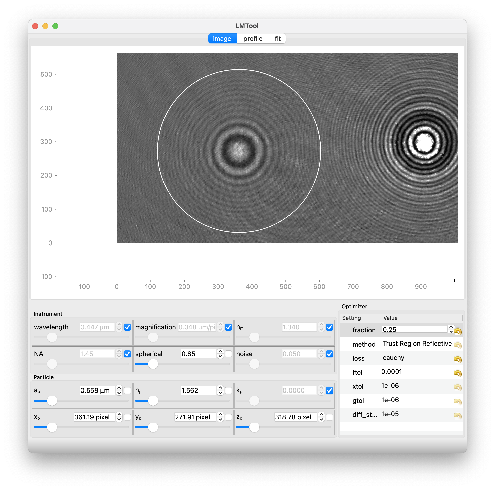
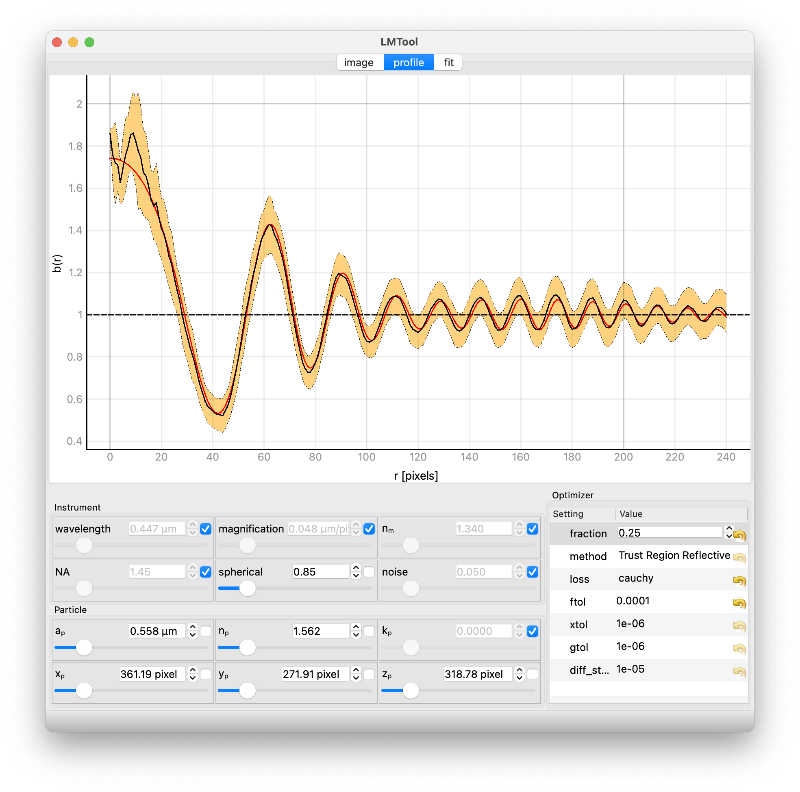
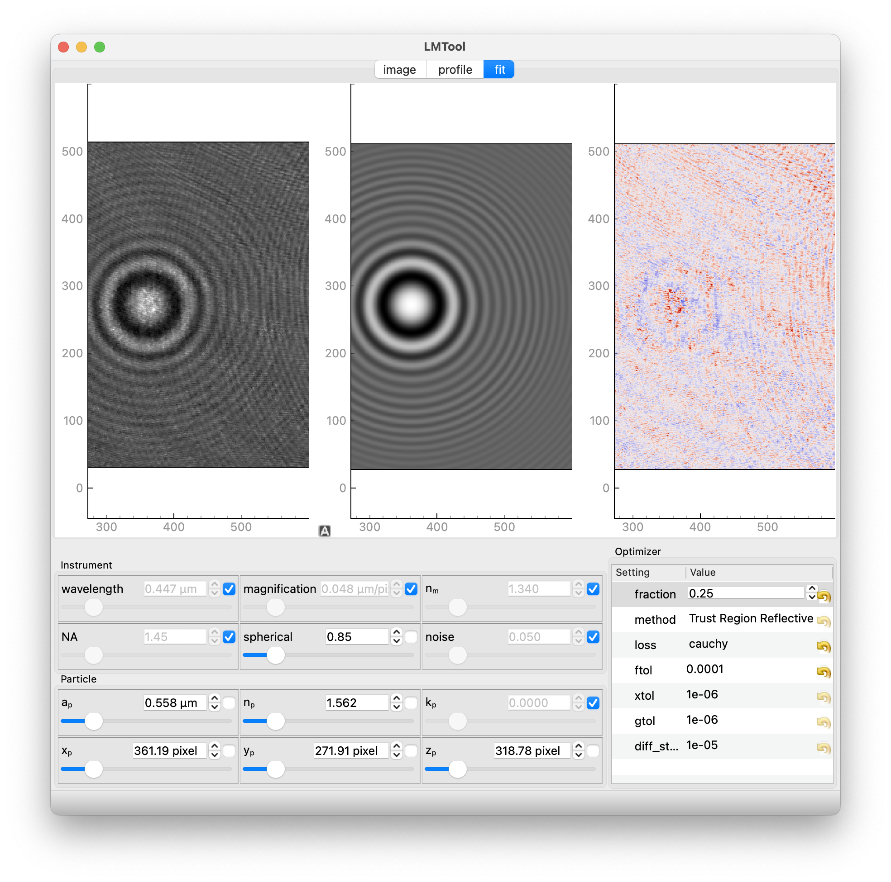

LMTool
======

**lmtool** is an interactive graphical application for loading holographic
microscopy images, positioning a region of interest around a particle, and
fitting a Lorenz-Mie scattering model to the hologram.

Launching
---------

After installation, launch from the command line::

    lmtool [image.png]

or equivalently::

    python -m pylorenzmie.lmtool [image.png]

Passing an image file loads it immediately on startup.  Without an
argument lmtool opens with a built-in example hologram.

Normalization
^^^^^^^^^^^^^

The Lorenz-Mie model predicts a hologram whose background intensity is 1,
so recorded images must be normalized before fitting.  lmtool normalizes
by dividing each pixel by the median pixel value of the image.  This works
well when most of the frame is background.

When a prerecorded background image is available, use it for higher-quality
normalization::

    lmtool image.png --background background.png

A scalar background value is also accepted (useful for 8-bit images with a
known camera offset)::

    lmtool image.png --background 100

A background image can also be loaded after startup via
**File → Open Background...**.

Interface
---------

The window is divided into a tabbed display area at the top and a control
panel at the bottom.

Image tab
^^^^^^^^^

The **Image** tab shows the full normalized hologram.  A circular
region-of-interest (ROI) marks the area around the particle to be fitted.

* **Drag the ROI centre** to reposition it over the particle.
* **Drag the ROI edge** to resize it so the rings are enclosed.

The ROI centre is used as the initial estimate of the particle's lateral
position (:math:`x_p, y_p`).

Profile tab
^^^^^^^^^^^

The **Profile** tab shows the azimuthally averaged radial intensity profile
of the hologram (black curve) together with the current model prediction
(red curve).  The orange band is ±1σ of the azimuthal variation.

Use this view to judge initial parameter estimates before running an
optimization.  A good starting point has the model rings roughly aligned
with the data rings in both position and amplitude.

Fit tab
^^^^^^^

The **Fit** tab shows three panels sharing the same spatial axes:

* **Left** — raw cropped hologram from the ROI.
* **Centre** — current model hologram.
* **Right** — normalized residuals ``(data − model) / noise``.

The model and residuals update live as parameters change and again after
each optimization.  Well-converged fits show structureless residuals with
magnitude ≲ 3.

Control panel
^^^^^^^^^^^^^

The bottom section of the window holds two groups of controls.

**Parameter controls** (left) — sliders for every particle and instrument
parameter.  Each slider has a lock button; locked parameters are held fixed
during optimization and are excluded from uncertainty estimates.

**Optimizer settings** (right) — controls the behaviour of the least-squares
solver: pixel fraction, method, loss function, and convergence tolerances.

Workflow
--------

1. **Load a hologram** — **File → Open ...** or pass a filename on the
   command line.
2. **Position the ROI** — drag the circle in the Image tab to centre it on
   the particle; resize it to enclose the fringe pattern.
3. **Adjust parameters** — move the sliders until the Profile tab model curve
   (red) matches the data in fringe spacing and amplitude.  The axial
   position :math:`z_p` has the strongest effect on fringe spacing;
   :math:`a_p` and :math:`n_p` affect the contrast.
4. **Optimize** — press **Ctrl+P** or choose **Optimization → Optimize**.
   The Fit tab updates to show the fitted model and residuals.
5. **Save results** — **Optimization → Save Result** writes an HDF5 file to
   ``~/data/lmtool/``; **Save Result As...** lets you choose the path and
   format (HDF5 or JSON).
